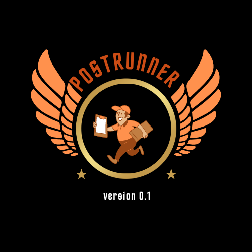
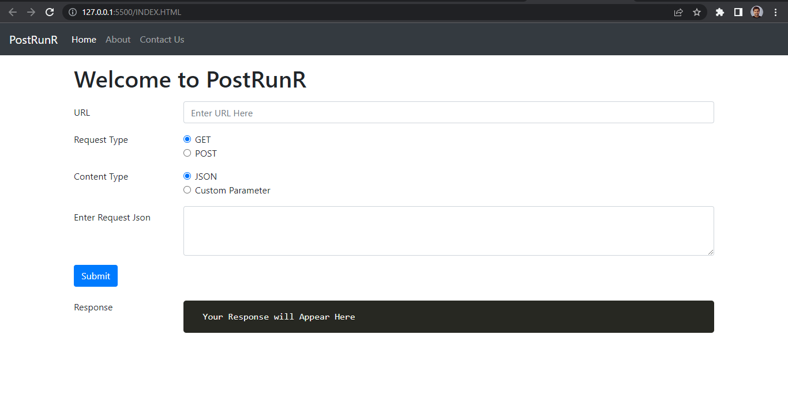

<br/>
<p align="center">
  <a href="https://github.com/sayantan135/PostRunR">
    
  </a>

  <h3 align="center">PostRunrR is a clone of Postman API</h3>

  <p align="center">
    GET SET POST REQUEST!
    <br/>
    <br/>
    <a href="https://github.com/sayantan135/PostRunR"><strong>Explore the docs »</strong></a>
    <br/>
    <br/>
    <a href="https://github.com/sayantan135/PostRunR">View Demo</a>
    .
    <a href="https://github.com/sayantan135/PostRunR/issues">Report Bug</a>
    .
    <a href="https://github.com/sayantan135/PostRunR/issues">Request Feature</a>
  </p>
</p>

      

## Table Of Contents

* [About the Project](#about-the-project)
* [Built With](#built-with)
* [Getting Started](#getting-started)
  * [Prerequisites](#prerequisites)
  * [Installation](#installation)
* [Usage](#usage)
* [Roadmap](#roadmap)
* [Contributing](#contributing)
* [License](#license)
* [Authors](#authors)
* [Acknowledgements](#acknowledgements)

## About The Project



PostRunrR is a clone of Postman API, which is a popular application programming interface that makes it easy for developers to create, share, test and document APIs. This is done by allowing the users to create and save simple and complex HTTP/s requests, as well as read their responses. It can make various types of HTTP requests like GET, POST, PUT, PATCH, saving environments for later use, converting the API to code for various languages like JavaScript, Python.


## Built With

This project is built using HTML, CSS and JavaScript.

## Getting Started

This is an example of how you may give instructions on setting up your project locally.
To get a local copy up and running follow these simple example steps.

### Prerequisites

This is an example of how to list things you need to use the software and how to install them.

* npm

```sh
npm install npm@latest -g
```

### Installation

1. Clone the repo

```sh
git clone https://github.com/sayantan135/PostRunR.git
```

## Usage

Use this space to show useful examples of how a project can be used. Additional screenshots, code examples and demos work well in this space. You may also link to more resources.

_For more examples, please refer to the [Documentation](https://example.com)_

## Contributing

Contributions are what make the open source community such an amazing place to be learn, inspire, and create. Any contributions you make are **greatly appreciated**.
* If you have suggestions for adding or removing projects, feel free to [open an issue](https://github.com/sayantan135/PostRunR/issues/new) to discuss it, or directly create a pull request after you edit the *README.md* file with necessary changes.
* Please make sure you check your spelling and grammar.
* Create individual PR for each suggestion.
* Please also read through the [Code Of Conduct](https://github.com/sayantan135/PostRunR/blob/main/CODE_OF_CONDUCT.md) before posting your first idea as well.

### Creating A Pull Request

1. Fork the Project
2. Create your Feature Branch (`git checkout -b feature/AmazingFeature`)
3. Commit your Changes (`git commit -m 'Add some AmazingFeature'`)
4. Push to the Branch (`git push origin feature/AmazingFeature`)
5. Open a Pull Request

## License

Distributed under the MIT License. See [LICENSE](https://github.com/sayantan135/PostRunR/blob/main/LICENSE.md) for more information.

## Authors

* **Sayantan Pal** - *Computer Science Student* - [Sayantan Pal](https://github.com/Sayantan135) - *project lead*
